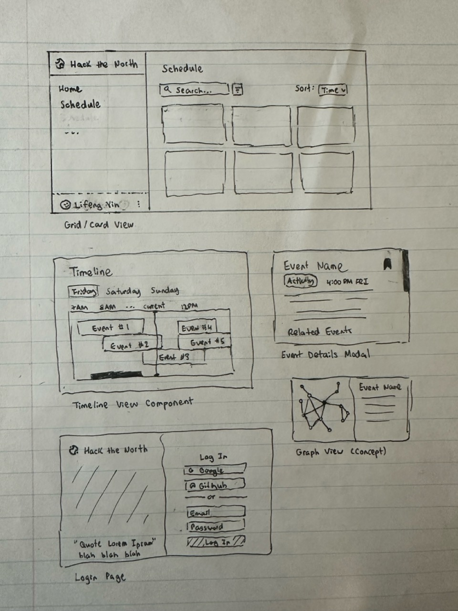
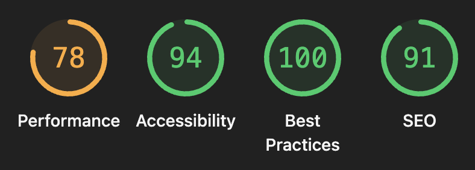

👋 Hey, Hack the North Team! 

This document outlines the brainstorming, code architecture, and some general thoughts surrounding my submission for the Frontend Challenge. I'd be happy to discuss anything I might have missed in a further interview! (should I recieve one, haha).

Live demo: https://hack-global-schedule.vercel.app.

# Development Process

## Wireframing

Before I code anything, I prefer to write down all of my thoughts and plans in my head onto one of my favourite mediums - pencil and paper.

Here, I've outlined several of the pages I planned to make. Spoiler alert - not all of them get to be finished. It at least helped me record all of my ideas, as well as get a sense of what I should prioritize.

## Tech Stack

### Main technologies

    

In past projects, I normally use this stack, except with Tailwind instead of styled-components. In this project, I wanted to try something new - not just because Hack the North uses (?) it, but because I thought pure CSS might be more useful for dynamic styling.

This was also my first time trying out base-ui. I found it to be pretty straightforward to use, having used both Radix and shadcn/ui before. I chose it particularly because it was unstyled, which allows me to have more design freedom and not deal with overriding classes.

### Other technologies
- **Wouter** - for simple routing, as opposed to using the more complex React Router
- **react-local-storage** - to simplify using local storage with states
- **microfuzz** - a simple searching library that is smaller than Fuse.js, and works just as well
- **boring-avatars** - cute library for making avatars! unfortunately only used it once in the entire codebase...

### AI???

I must confess, Generative AI has gotten more and more enticing to use lately. In this project, I used Cursor (both tab and agents). I found Cursor-tab to be more reliable (mostly for simple tasks like updating imports). Cursor Agents was more powerful, as it could create entire components. I made sure all of the code it wrote was clean and made sense.

It did seem to struggle a bit with base-ui (which is new and it's likely not familiar with it). Overall, I did see my productivity increase a bit using it.

# Future Extensions
## Theming

I did create a themeProvider component near the start of the project, but I later forgot about it and did not end up using it. Now, my codebase is littered with a bunch of different hex codes that makes for horrible consistency. A future extension would be to actually use the themeProvider. As well, it would make a light mode toggle very seamless.

## Features

As seen in my wireframe, there were a bunch of features that I did not have time to implement. These included a bookmark feature, a timeline view, and even a graph-view to see related events. While the grid view is sufficient to view all of the data, adding these features would allow hackers to see the data in a completey different way.

### Concept: bookmark system
- Allows users to save and reorder events that they are interested in
- Similar to a "Favourites" feature in many social media apps
- User clicks a button in the top-right corner of an image, and the bookmark is filled with colour (green)
- The user can then view the bookmarked items on a separate page (grid view)
- Reordering would have been done with [motion.dev](https://motion.dev/docs/react-reorder) (which was formerly Framer-motion)
- The order of bookmarked events would then be saved after every reorder

## Performance

I actually ran a Lighthouse report after finishing the code, and the performance result was particularly disappointing (78/100). I didn't really think to optimize speed that much as it felt snappy on my laptop. However, Lighthouse does point out some relatively simple optimizations that would (hopefully) boost the performance significantly if implemented.

# Areas of Pride

## Accessibility, Best Practices, SEO

As shown in the Lighthouse report, I did pretty well in the other areas that it measures. While I'm sure that a couple more `aria-role` attributes can be added, I'm confident that the app as it is excellent in terms of these criteria.

## Responsive Design

I couldn't exactly get the search bar and dropdowns to be exactly optimized for mobile in time; however, I'm proud of how responsive the sidebar as well as the grid view is for any screen size. CSS Flexbox was particularly useful for making the grid responsive.

## Code maintainability

The file structure was inspired by Brad Frost's [Atomic Design](https://atomicdesign.bradfrost.com/chapter-2/) methodology. While it is simplified since this project doesn't have too much files, I found that it worked well to keep my code DRY and my files organized. 

Componentization was prioritized heavily - I tried to break down most components that were over 200 lines of code. Hooks and utils were also used. However, this was mostly done after coding them first in one big file (for example, Dashboard.tsx). I found that coding before organizing helped with developer speed and made for some intuitive organization at the end.

## Login System

Even though it was a mock account system, it still took me surprisingly long to build and style the login page. I added validation, redirects, a working logout button, and anything else I could think of. Even finding the Mr. Goose photo also took a long time (because I couldn't find any of myself in the Hack the North photos...) 

There is one issue that I didn't catch: users aren't able to view events until they are logged in. This would have been a simple fix - display the schedule along with a Login button on the main page. Although, users are still able to access the private_events by calling the API...

Nevertheless, the final result does happen to be the prettiest login page that I have created!
